# Three-Tier Architecture on AWS — "Tech with Ajit" Hello World App

A complete, production-pattern three-tier web application deployed on AWS, built end-to-end manually through the AWS Console to learn core AWS networking, compute, database, and high-availability concepts.

**Architecture inspired by:** [ajitinamdar-tech/three-tier-architecture-aws](https://github.com/ajitinamdar-tech/three-tier-architecture-aws)

Built by: **Sameer**

---

## Table of Contents

1. [Project Overview](#project-overview)
2. [Architecture Diagram](#architecture-diagram)
3. [Tech Stack](#tech-stack)
4. [Step-by-Step Implementation](#step-by-step-implementation)
5. [Security Design](#security-design)
6. [End-to-End Verification](#end-to-end-verification)
7. [Monitoring & Auto Scaling](#monitoring--auto-scaling)
8. [Challenges Faced](#challenges-faced)
9. [What I'd Improve](#what-id-improve)
10. [Credits](#credits)

---

## Project Overview

This project is a simple "Hello World" three-tier application demonstrating the separation of frontend, backend, and database layers — deployed on real AWS infrastructure with proper network isolation, load balancing, and auto scaling.

**What it does:**
- Displays messages stored in a MySQL database
- Allows users to submit new messages through a web form
- Demonstrates a fully isolated 3-tier network: only the frontend is internet-facing; the backend and database are completely private

**Why I built it this way:**
I wanted a project that went beyond a simple 2-tier app+database setup — this architecture uses **two separate Application Load Balancers** (one public, one internal) to properly isolate the frontend and backend tiers, which is closer to how real production systems are designed.

---

## Architecture Diagram

```
                        Internet
                           |
                           v
              ┌─────────────────────────┐
              │   Frontend ALB          │  (Internet-facing)
              │   web-public-1a/1b/1c   │
              └───────────┬─────────────┘
                           |
                           v
              ┌─────────────────────────┐
              │  Frontend ASG (Nginx)   │
              │  web-private-1a/1b/1c   │
              └───────────┬─────────────┘
                           | (Nginx reverse proxy: /api/*)
                           v
              ┌─────────────────────────┐
              │   Backend ALB           │  (Internal only)
              │   app-private-1a/1b/1c  │
              └───────────┬─────────────┘
                           |
                           v
              ┌─────────────────────────┐
              │ Backend ASG (Apache+PHP)│
              │  app-private-1a/1b/1c   │
              └───────────┬─────────────┘
                           |
                           v
              ┌─────────────────────────┐
              │   RDS MySQL             │
              │   db-private-1a/1b/1c   │
              └─────────────────────────┘
```

**Key design principle:** Every tier can only be reached by the tier directly above it. The database cannot be reached by the frontend or the internet — only by the backend servers. This is enforced entirely through security group chaining (see [Security Design](#security-design)).

---

## Tech Stack

| Layer | Technology |
|---|---|
| Frontend | HTML, CSS, JavaScript, served by Nginx |
| Backend | PHP 8.5, Apache (httpd) |
| Database | Amazon RDS (MySQL) |
| Networking | Custom VPC, 12 subnets across 3 AZs, IGW, NAT Gateway |
| Load Balancing | 2× Application Load Balancer (1 internet-facing, 1 internal) |
| Compute | Amazon EC2 (Amazon Linux 2023), 2× Auto Scaling Groups |
| Monitoring | Amazon CloudWatch Alarms + Amazon SNS (email alerts) |
| Region | us-east-2 (Ohio) |

---

## Step-by-Step Implementation

### 1. VPC & Subnets
Created a custom VPC (`10.0.0.0/16`) with **12 subnets** across 3 Availability Zones, split into 4 tiers:

| Tier | Purpose | AZs |
|---|---|---|
| `web-public` | Hosts the Frontend ALB | 1a, 1b, 1c |
| `web-private` | Hosts Nginx (frontend) EC2 instances | 1a, 1b, 1c |
| `app-private` | Hosts the Backend ALB + PHP EC2 instances | 1a, 1b, 1c |
| `db-private` | Hosts RDS MySQL | 1a, 1b, 1c |

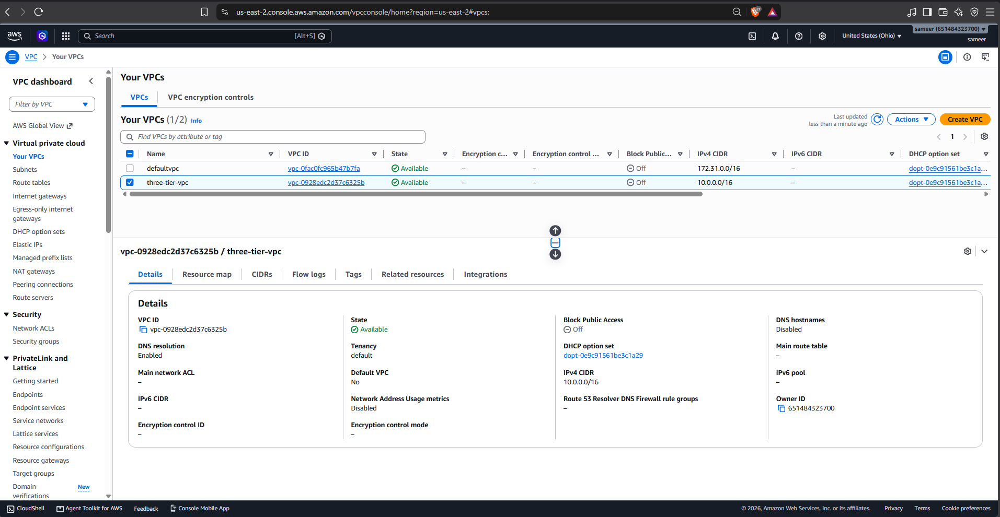
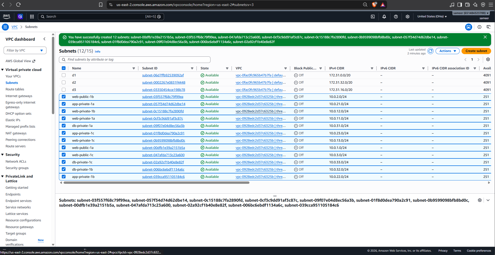

### 2. Internet Gateway & NAT Gateway
- Internet Gateway attached to the VPC, giving `web-public` subnets internet access
- NAT Gateway deployed in `web-public-1a` with an Elastic IP, allowing private subnets outbound-only internet access (for package installs, updates) without being reachable from outside

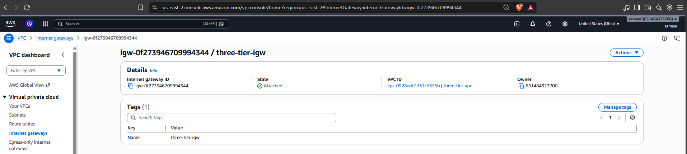
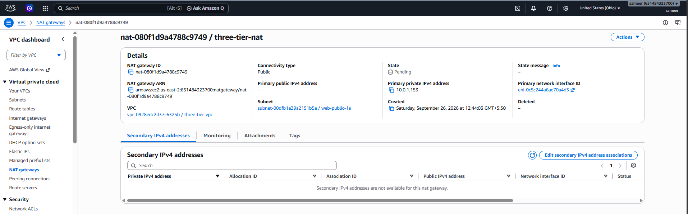

### 3. Route Tables
Four route tables, one per tier:

| Route Table | Subnets | 0.0.0.0/0 Target |
|---|---|---|
| `web-public-rt` | web-public-1a/1b/1c | Internet Gateway |
| `web-private-rt` | web-private-1a/1b/1c | NAT Gateway |
| `app-private-rt` | app-private-1a/1b/1c | NAT Gateway |
| `db-private-rt` | db-private-1a/1b/1c | NAT Gateway |

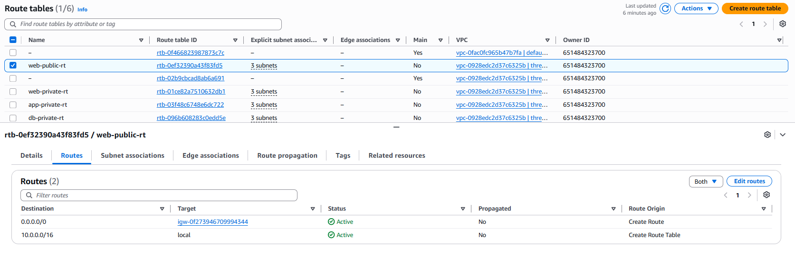

### 4. Security Groups
Five security groups enforcing strict tier-to-tier access (see [Security Design](#security-design) for details).

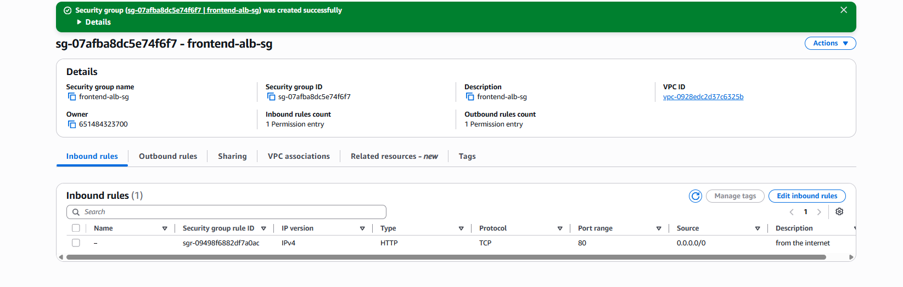
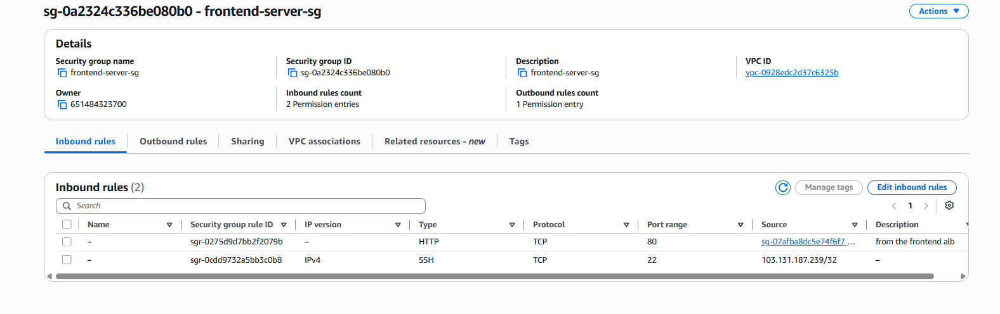
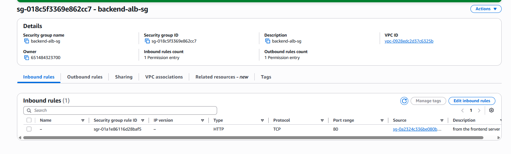
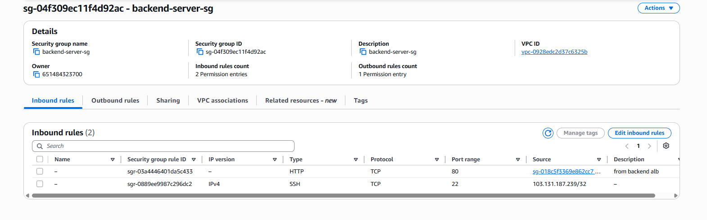
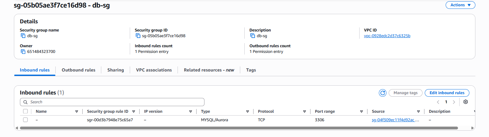

### 5. RDS MySQL Setup
- Created a DB subnet group spanning all 3 `db-private` subnets (required by AWS for Multi-AZ readiness)
- Launched a MySQL RDS instance, `db.t3.micro`, with **no public access**, attached only to `db-sg`
- Ran `database_setup.sql` to create the `hello_world` database and `messages` table

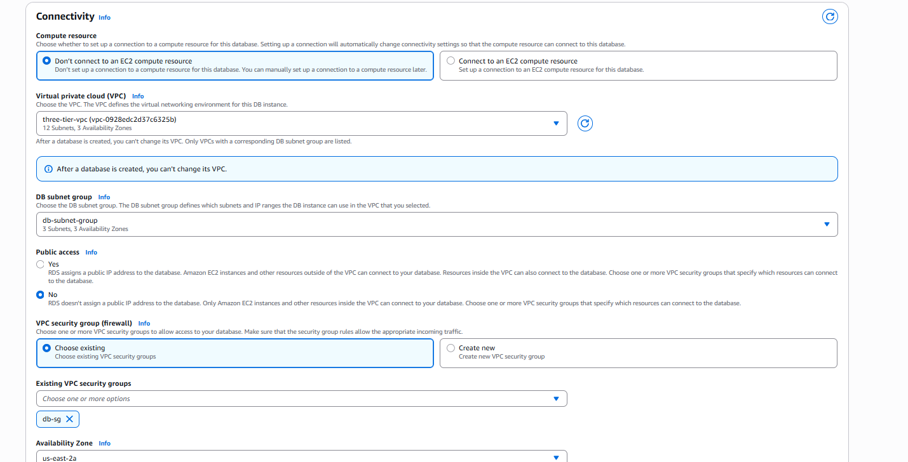
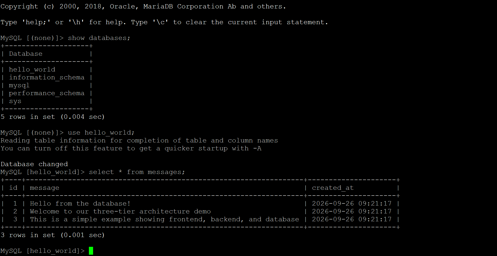

### 6. EC2 Setup (Jump Server + Temp Instances)
Since frontend/backend instances live in private subnets with no public IP, I set up a **jump server (bastion host)** in a public subnet to SSH into them.

- `jump-server` — public subnet, public IP, SSH open only to my IP
- `frontend-server-temp` — private subnet, installed Nginx, deployed static frontend files
- `backend-server-temp` — private subnet, installed Apache + PHP, deployed backend API, connected to RDS


### 7. Application Deployment & Testing
- Installed Nginx on the frontend server, deployed the static HTML/CSS/JS
- Installed Apache + PHP on the backend server, deployed the PHP API, configured `db_connection.php` with the RDS endpoint
- Verified both GET and POST API endpoints work correctly via `curl`, and confirmed data persists in RDS

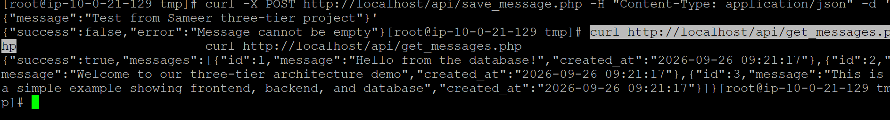
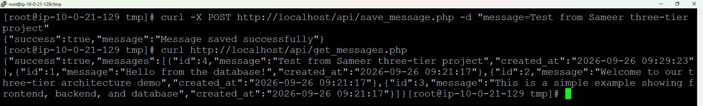

### 8. Nginx Reverse Proxy Configuration
The frontend JavaScript calls the API using **relative paths** (e.g. `api/get_messages.php`), so I configured Nginx to reverse-proxy any request to `/api/` through to the internal Backend ALB:

```nginx
location /api/ {
    proxy_pass http://internal-backend-alb-xxxxxxxxx.us-east-2.elb.amazonaws.com/api/;
    proxy_set_header Host $host;
    proxy_set_header X-Real-IP $remote_addr;
    proxy_set_header X-Forwarded-For $proxy_add_x_forwarded_for;
    proxy_set_header X-Forwarded-Proto $scheme;
}
```


### 9. AMI Creation
Created custom AMIs from both fully-configured, tested EC2 instances — these serve as the "golden images" for Auto Scaling:
- `frontend-server-ami` (rebuilt as v2 after the Nginx reverse proxy fix)
- `backend-server-ami`

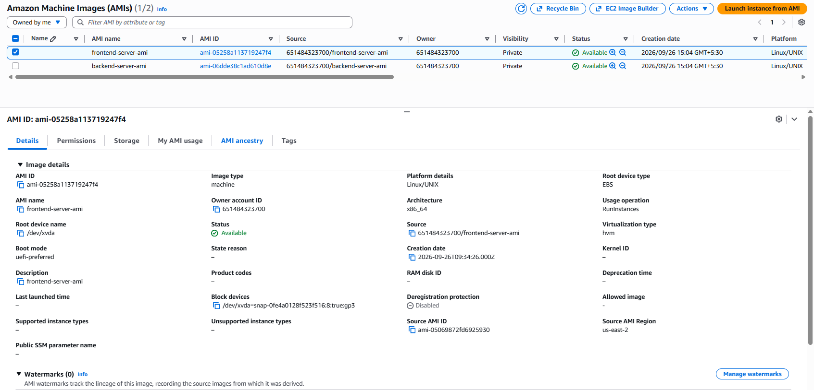
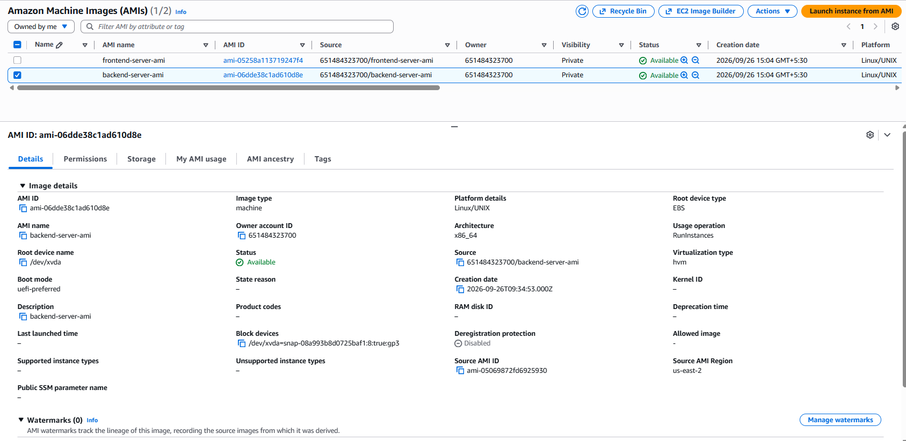

### 10. Target Groups & Load Balancers
- **`frontend-tg`** — health check on `/`, attached to **`frontend-alb`** (internet-facing, spans all 3 public subnets)
- **`backend-tg`** — health check on `/api/get_messages.php`, attached to **`backend-alb`** (internal, spans all 3 app-private subnets)

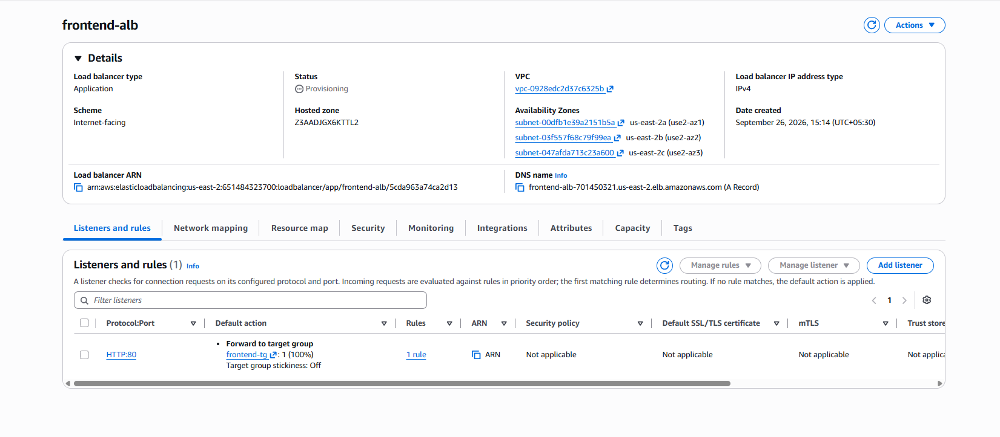
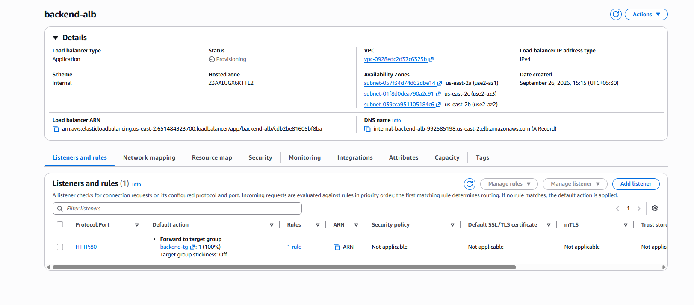
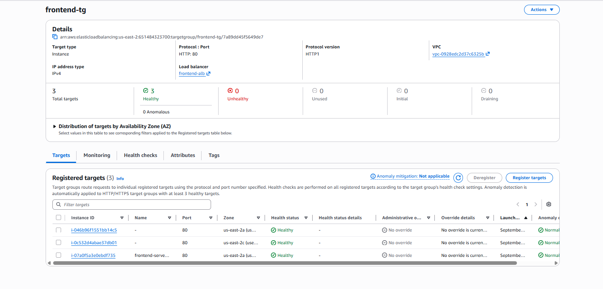
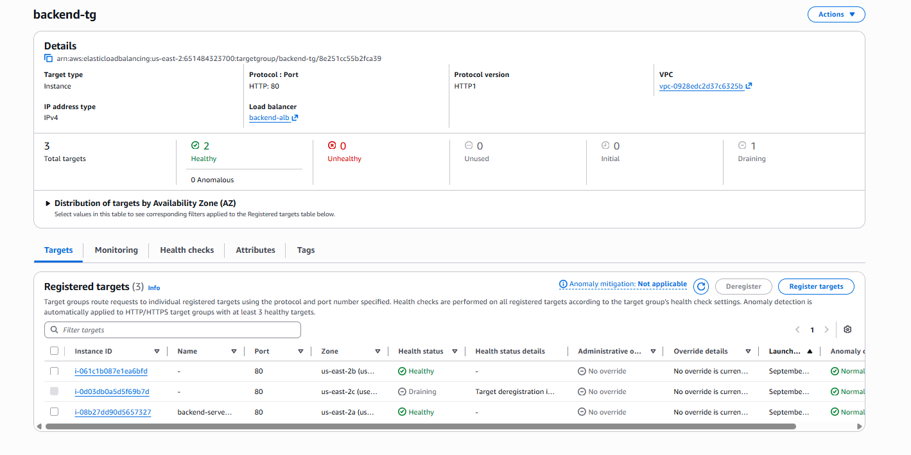

### 11. Launch Templates & Auto Scaling Groups
- `frontend-lt` / `backend-lt` — define AMI, instance type, key pair, security group (subnet intentionally left blank, so the ASG controls placement)
- `frontend-asg` / `backend-asg` — desired capacity 2, min 2, max 4, spread across all 3 subnets per tier, attached to their respective target groups, using **ELB health checks** (not just EC2 status checks)


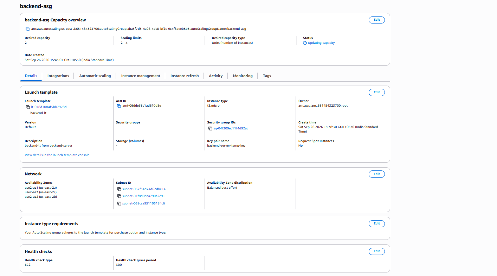

---

## Security Design

Traffic can only flow one tier at a time — nothing can skip a layer:

```
Internet → frontend-alb-sg → frontend-server-sg → backend-alb-sg → backend-server-sg → db-sg
```

| Security Group | Inbound Rule | Source |
|---|---|---|
| `frontend-alb-sg` | HTTP (80) | `0.0.0.0/0` (internet) |
| `frontend-server-sg` | HTTP (80) | `frontend-alb-sg` |
| `frontend-server-sg` | SSH (22) | `jump-server-sg` |
| `backend-alb-sg` | HTTP (80) | `frontend-server-sg` |
| `backend-server-sg` | HTTP (80) | `backend-alb-sg` |
| `backend-server-sg` | SSH (22) | `jump-server-sg` |
| `db-sg` | MySQL (3306) | `backend-server-sg` |
| `jump-server-sg` | SSH (22) | My IP |

**Why security-group-to-security-group, not IP ranges?** Sourcing a rule from another security group (rather than a CIDR/IP) means "only resources wearing that SG's badge can connect" — regardless of the actual IP, subnet, or how many instances exist. This means Auto Scaling can launch or terminate instances freely, and the security rules automatically apply to every new instance without needing manual IP updates.

The database is never reachable by the frontend, the internet, or even the backend ALB — only by instances in `backend-server-sg`.

---

## End-to-End Verification

1. **Browser test** — loaded the app via the Frontend ALB's DNS name, confirmed the page renders and displays messages from RDS
2. **Write test** — submitted a new message through the form, confirmed it appears in the list and persists in the RDS database
3. **Self-healing test** — after fixing a target group health check misconfiguration, observed the Auto Scaling Group automatically detect the previously-unhealthy instance and replace it without manual intervention
4. **Full ASG cutover test** — stopped both original temp EC2 instances and reloaded the app; confirmed it continued working entirely on Auto Scaling Group-launched instances, proving no dependency on the original manually-configured servers

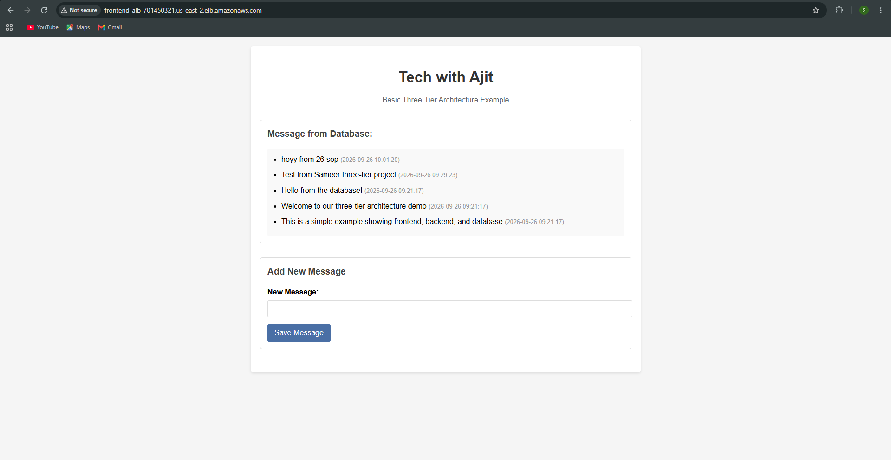
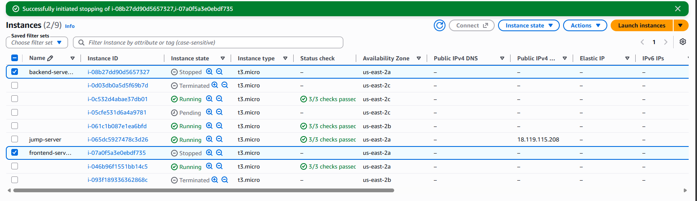

---

## Monitoring & Auto Scaling

Configured a full dynamic scaling loop for the backend tier using CloudWatch Alarms + SNS:

| Alarm | Condition | Action | Notification |
|---|---|---|---|
| `Backend-HighCPU-Alarm` | CPUUtilization > 70% for 1 period (5 min) | Add 1 instance | Email via SNS |
| `Backend-LowCPU-Alarm` | CPUUtilization < 20% for 1 period (5 min) | Remove 1 instance | Email via SNS |

Both alarms are linked to Auto Scaling dynamic scaling policies (`server-creatio-policy`, `server-deletion-policy`) on `backend-asg`, and both send email notifications via an SNS topic (`threetier-alerts`) on every state change.

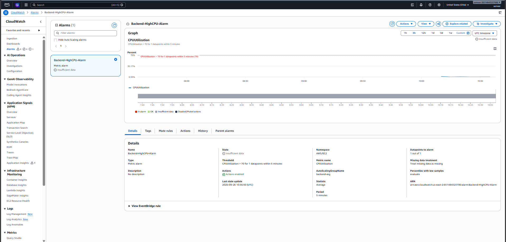
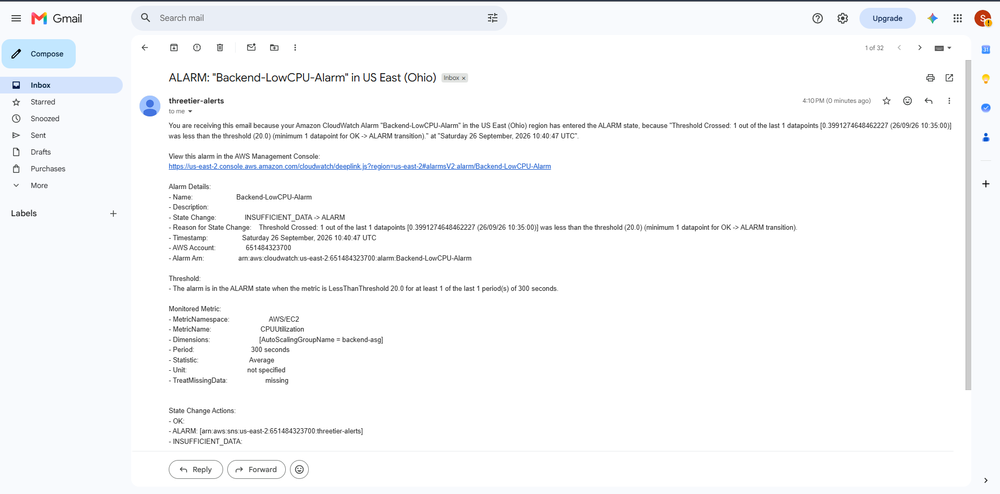
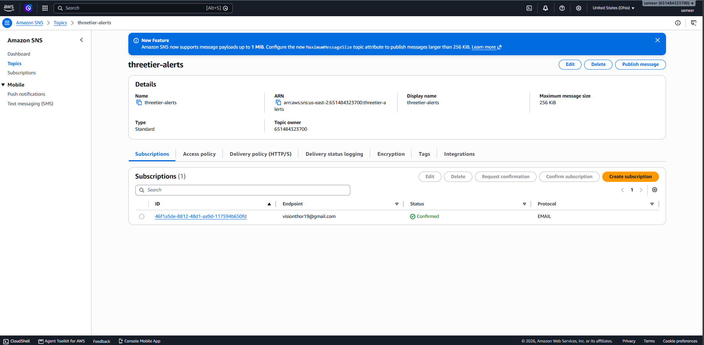
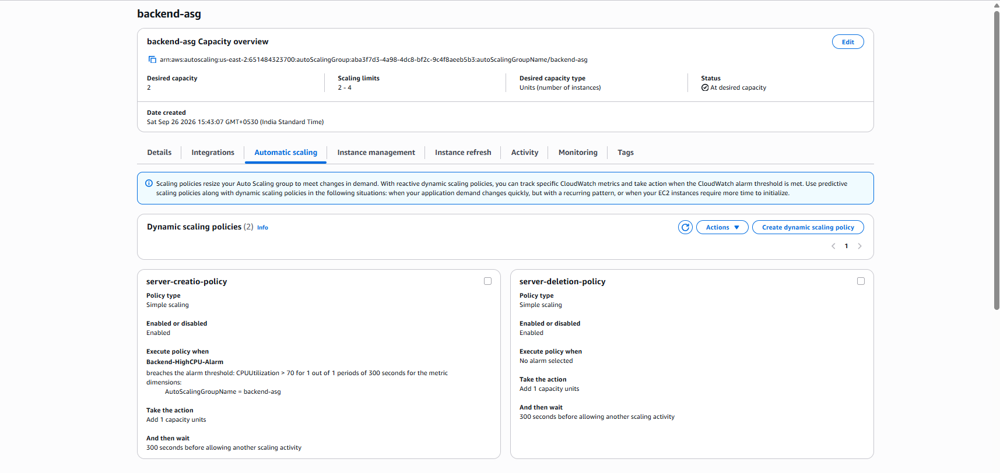
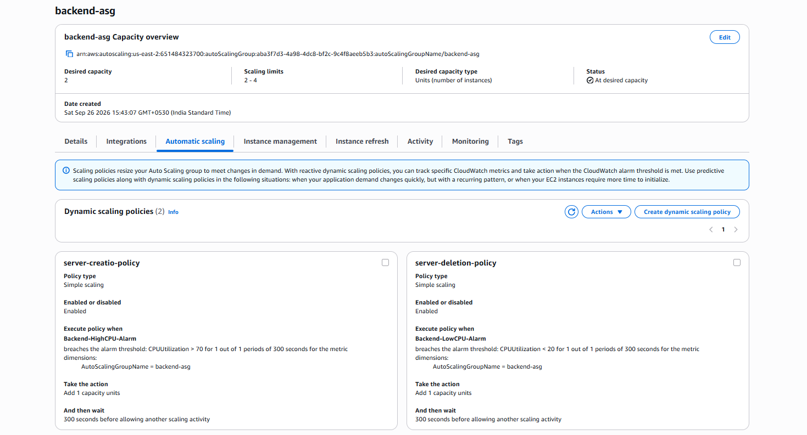

---

## Challenges Faced

- **SSH into private instances**: initially tried SSHing directly into private-subnet EC2 instances from my laptop and it hung indefinitely. Diagnosed that private IPs are unreachable from outside the VPC, and solved it by setting up a jump server (bastion host) pattern.
- **SSH from jump server timing out**: after setting up the jump server, SSH to the frontend/backend servers still hung. Root cause was the security groups only allowed SSH from "My IP" (my laptop), not from the jump server's own IP/security group. Fixed by adding an inbound rule sourcing from `jump-server-sg`.
- **POST API request failing silently**: `save_message.php` returned `"Message cannot be empty"` even when a message was sent. Investigated the PHP source directly and found it expected form-encoded (`$_POST`) data, not JSON — my initial `curl` command was sending the wrong content type.
- **Reverse proxy required**: discovered the frontend's JavaScript calls the API using relative paths (`api/get_messages.php`), which meant the browser would try to hit the frontend's own domain for API calls. Solved this by configuring Nginx to reverse-proxy `/api/` requests to the internal Backend ALB.
- **503 errors from the Backend ALB**: after creating the ALB and Target Group, requests returned 503 "Service Temporarily Unavailable." Diagnosed as no targets being registered to the target group (Target Groups don't auto-register instances outside of Auto Scaling) — fixed by manually registering the temp EC2 instances.
- **Target Group health check misconfiguration**: after switching to Auto Scaling, the backend target group showed all instances "unhealthy" despite the API working correctly via direct `curl`. Found the health check path was set to `/` (default), which doesn't exist on the Apache server (only `/api/*` routes exist) — fixed by changing the health check path to `/api/get_messages.php`.
- **Auto Scaling policy misconfiguration**: initially set the "scale-in" (low CPU) policy to *add* capacity instead of *remove* it — caught this by reviewing the policy details closely before testing, since it would have made the low-CPU scenario worse rather than better.

---

## What I'd Improve

- **HTTPS**: currently HTTP only; would add an ACM certificate and HTTPS listeners on both ALBs for a production-realistic setup
- **Secrets Manager**: RDS credentials are currently hardcoded in `db_connection.php`; would move these to AWS Secrets Manager or Parameter Store
- **Infrastructure as Code**: this entire setup was built manually through the AWS Console; a natural next step would be to rebuild it using Terraform for repeatability
- **CI/CD Pipeline**: currently, code changes require manually SSHing in and re-creating AMIs; a CI/CD pipeline (GitHub Actions or CodePipeline) could automate deployment
- **Target tracking scaling** instead of simple scaling policies, for smoother, more automatic capacity adjustments
- **Multi-AZ RDS** for database-level high availability (currently single-AZ)

---

## Credits

Architecture and application code based on [ajitinamdar-tech/three-tier-architecture-aws](https://github.com/ajitinamdar-tech/three-tier-architecture-aws).

All AWS infrastructure setup, configuration, debugging, and testing was done independently as a hands-on learning project.
